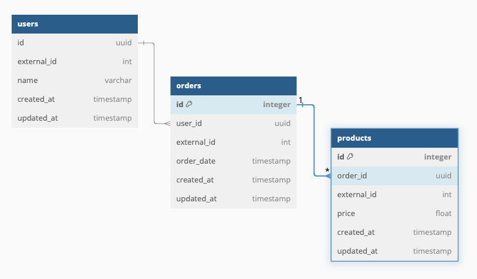

# Luiza Labs Changelle

## Introduction

**This project consists of a small API that receive and parses a .txt file with orders data that will be available in a structured JSON format through some endpoints. To make this work the data become from txt file is stored on a SQL database in a entity based structure (User, Order and Product) to be easily returned in an JSON.**

## ER Diagram



## Technologies:

* Github
* Docker
* Ruby version 3.3.1
* Ruby on Rails 8.0.0
* Postgres 15.3
* Sidekiq
* Redis

## Project setup:

In project folder (after clonning from Git), run:

`docker compose build`
`docker compose up -d`

After that containers must running, and we as good run the migrations:

`docker compose run --rm web bin/rails db:migrate`

Now, the database is ready to receive the data through the endpoint `POST /import-file`. Check more details from this endpoint on Endpoint documentation session.

## Run tests:

To setup databse (just need to run first time or when migration changes):
`docker compose run --rm web bin/rails db:migrate RAILS_ENV=test`

To run test suite:
`docker compose run --rm web bundle exec rspec`

## Endpoint usage:

All endpoints work on host: `localhost:3000`.

## Endpoint documentation:

`POST /import-file`

Description: Receive a file with .txt format and asynchronously process and add data in database.

Body:
 - file: path to file that should be uploaded

Response:
204 - No content

Example: `curl --location 'localhost:3000/import-file --form 'file=@"filePath"'`

`GET /users?per_page={integer}&page={integer}&order_id={string}`

Description: Return a list of users with their orders and related products.

Parameters:
- page (integer): Starting index for the result set (default 1)
- per_page (integer): Number of users to return (default 10)
- order_id (integer): Field with old system order id (e.g. 123)

Response:
200
```
[
    {
      "user_id": 123,
      "name": "John Doe",
      "orders": [
        "order_id": 456,
        "total": "1234.56"
        "date": "2021-03-12",
        "products": [
            "product_id": 678,
            "value": "1234.56"
        ]
      ]
    },
    ...
]
```

`GET /users/:id`

Description: Return a single user by their old system id.

Parameters:
- id (integer): Field with old order id (e.g. 123)

Response:
200
```
{
  "user_id": 123,
  "name": "John Doe",
  "orders": [
    "order_id": 456,
    "total": "1234.56"
    "date": "2021-03-12",
    "products": [
        "product_id": 678,
        "value": "1234.56"
    ]
  ]
}
```

`GET /orders?per_page={integer}&page={integer}&start_date={string}&end_date={string}`

Description: Return a list of orders with related user and products.

Parameters:
- page (integer): Starting index for the result set (default 1)
- per_page (integer): Number of users to return (default 10)
- start_date (string): Field with initial order date (with YYYY-mm-dd format, e.g. "2021-03-18")
- end_date (string): Field with order limit date (with YYYY-mm-dd format, e.g. "2021-03-18")

Response:
200
```
[
    {
        "order_id": 456,
        "total": "1234.56"
        "date": "2021-03-12",
        "user": {
          "user_id": 123,
          "name": "John Doe",
        }
        "products": [
            "product_id": 678,
            "value": "1234.56"
        ]
    }
    ...
]
```

`GET /orders/:id`

Description: Return a single order by their old system id.

Parameters:
- id (integer): Field with external order id (e.g. 123)

Response:
200
```
{
    "order_id": 456,
    "total": "1234.56"
    "date": "2021-03-12",
    "user": {
      "user_id": 123,
      "name": "John Doe",
    }
    "products": [
        "product_id": 678,
        "value": "1234.56"
    ]
}
```